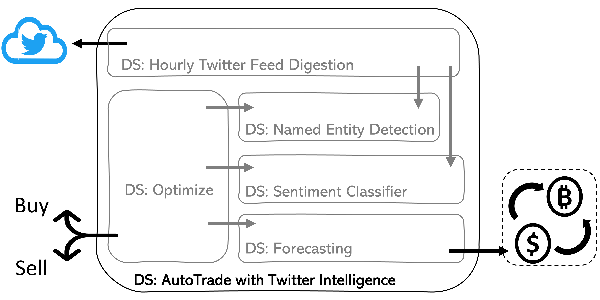

# Answers to Case Studies Chapter 1

The answers to the questions that were raised in **Case Study  1 – Autonomous Vehicles of Chapter 1 are provided here.

## Study tips
 - Make sure to have given the questions a try before reading my answers
 - The provided answers are one of many possible and correct answers that can be given to the raised questions.
 - It will be great to compare your answers with my answers and use common sense and logic to find the better parts of each answer.

Now, let’s look at the questions

## Case Study 1: Autonomous Vehicles
**Q1. Is the Lead Engineering Manager describing a big data situation? What are the clues?**

Yes. The Lead Engineering manager does describe a big data situation that will come about after enabling V2V and V2X communications. The clue is that the executive summary outlines having to “handle incoming data”. 

**Q2. In which direction(s) the data is getting bigger?**

Out of the three directions of growth (the 3Vs), in this situation, only the variety of data increases. The data that the vehicles and the company have to handle now is of a completely different nature such as image data, and GPS location data. In the future, the V2V and V2X communication data will be added to the mix. 
Even though, that the current data volumes or velocity will not change, however, the volume and velocity of V2V and V2X communication data are very high.

**Q3. What are the HLCUs of the data that the Lead Engineering Manager mentions?**

To meet the federal mandate, that is communication with the other cars and other things, the HLCU will be computers. The other application of the data that the manager mentions, analytical and operational potentials, can be either computers or humans. If they end up on the car’s dashboard or some manager’s visualization dashboard for decision-making the HLCU would be human, but if the data gets used in a machine learning algorithm that would be computers again. 

**Q4. The case study does not provide a lot of details as far as the capability of Lucid Motors in dealing with big data, however, it does mention that Lucid Motors is a leader in semi-autonomous EV manufacturing. Use this fact to imagine what could be the capabilities of Lucid Motors in dealing with big data.**

The company is already very capable of handling a ton of data. The image data that is generated to fuel Computer Vision enabling autonomous navigation of the vehicle is rather large. The velocity of incoming images is 200 per second, and the electrical vehicle has 8 cameras. Therefore, one car will produce 5760000 (60*60*200*8) frames in one driving hour. This is a large incoming data, and it is apparent that Lucid Motor is capable of all the strategies for solving big data problems such as technology, skills, and the ability to find the right compromises.

**Q5. Based on your answers in Q2 and Q4, describe the big data problem Lucid motor is facing.**

The company is facing big data that grows in direction of variety. The company is already adept at handling GPS and image data that are both high in volume and velocity. The challenge they have is to deal with another source of high volume and velocity of data, and that is V2V and V2X communication data. 
Let’s make some approximations for the velocity and volume of this new source of data. Kay Freeway, or interstate 10, with a whopping 26 lanes is the widest highway in the United States. When the traffic is congested, in two miles of this highway we’d expect to see about 4576 (176*26) cars, and if the cars communicate every second, in an hour of driving we’d have about 16,473,600 (4576*60*60) communication logs. This large number of data objects does not even cover the communication logs that each car would have to be able to handle with everything else. 

**Q6. Provide reasons as to which strategy or strategies of solving big data problems Lucid motors should be adopting.**

As mentioned in the chapter, the strategy of compromise will be in the mix. The reason is there is always room for improvement, but at some point, the cost of the improvement will become too much to be worth it. 
Based on what we concluded in Q4, the company must be well poised to handle the volume and velocity of the data, however, the company might need to skill up in its ability to deal with and effectively analyze V2V and V2X communication. 
Furthermore, the company may have to purchase more computing and storage resources for each car, and also for its operational, analytical, and experimental activities at the company level.

## Case Study 2: Request Chatbot  
**Q1. The implementation request chatbot led to the discovery of three issues. Outline these three issues, and mention if any of them are the consequence of a big data situation.**

Let's first go over the three issues, and then discuss which ones are related to Big Data problems.
  1. The first issue is that for the three UK hotels, the rate of NLP classifier mistakes was too high, leading to unhappy customers and more costs. 
  2. The second issue is that the system got overwhelmed when there is more guest in larger hotels. 
  3. The third issue is that there cannot be inputs to the system other than the guest requesting. This has shown itself in the guest receiving confusing messages even though they had already been served. If the hotel staff could stop the workflow once a request has been taken care of this would resolve.

The second issue is certainly a big data issue. In the bigger hotels, there is more Volume of guests and therefore more Velocity of requests and if this has not been considered in the design, the traffic can negatively impact the performance. 

While the first, and third issues are not directly because of bid data but big data are not irrelevant in them either. In the first one, we kind of have a reverse big data issue, the Variety of the data has not been enough so the trained models were not able to generalize beyond culture. 

Lastly, the third issue is an aftermath of a big data issue not having been solved (second issue) and causing more issues. 

**Q2. Specify the direction of growth in the big data situation(s) that you identified in Q1. If there is more than one big data situation, specify per situation.**
This is already answered in the response to Q1, pay attention to the capital Vs. 

**Q3. Using Figure 1.3, what do you believe is the skill level of the R&D team regarding big data? Are they at or around Data Analysts, Data Scientists, or Data Engineers? Provide reasons for your thoughts. **

Regarding Figure 1.3, the team’s skill level is at the Data Scientist level. This is obvious as the team was successful at all the modeling aspects, however, they had the most issues with deployment at Scale, adding some data engineering skills can significantly improve the team’s performance. 

**Q4. Which strategy or strategies would you recommend the R&D team uses to deal with their big data problem(s) identified in Q1? Answer per big data situation.**

As mentioned under Q1, the only big data situation was issue 2. As the Volume of guests and Velocity of requests increases, the deployed models by the team get overwhelmed. This may be solved by either one of or a combination of Skilling UP and Purchasing Mor Technology. 
The team could learn about code optimization, data pipelining, and model orchestrations to improve the performance of the solution so it can meet the required volume or velocity. Furthermore, the team could also buy more compute resources, and scale up the resources vertically so that when there is more traffic, there are more computers to handle the requests.   

## Case Study 3: Cryptocurrency Twitter Intelligence
**Q1. Draw a data flow similar to Figure 1.1 and Figure 1.2. You will have to first what are the internal data solutions and make sure that the flow of the data is logical and reasonable. **

For a successful Cryptocurrency Twitter Intelligence, we the company would need the following data solutions. 
 - Hourly Twitter Feed Digestion
 - Named Entity Detection
 - Sentiment Classifier
 - Forecasting
 - Optimizer

A logical flow of these data solutions would look like the following. The DS Hourly Twitter Feed Digestion will pull all the tweets made by select accounts. These tweets will be given to the two DSs Named Entity Detection and Sentiment Classifiers. The Named Entity Detection DS will check if there is a mention of any of the cryptocurrencies. The Sentiment Classifier DS will specify the tone of the tweets as positive, neutral, or negative. The Forecasting DS will get the data from the cryptocurrency market, and based on the historical data come to a predicted price for the cryptocurrencies. Finally, the Optimizer DS will get the results for the three intermediate DSs, and based on their inputs decide to hold position, buy, or sell the assets.

Q2
Specify the HLCUs of the data at each internal data solution in the data flow you created for Q1.
The HLCUs for the flowing data in the above diagram are computers, except for the tweet inputs. That being said, the flowing data at all levels are understandable for human language too.  
Q3
Before the company moves forward with the listed possible improvements listed above, specify which type of big data situation might the company find itself in. Also, specify the direction of data growth in the big data situation. 
The company will likely have to face many big data situations that will force them to use all and combinations of dealing with big data situations. The suggested possible improvements will take the company to new data territory with higher Volume, higher Velocity, and higher Variety. 
Let’s go over the list of improvements one by one and discuss the directions of data growth for each. 
Increase the number of Twitter accounts from 100 to 1000.	Higher Velocity
Include the comments, and retweets of the relevant tweets into the weighted sentiment calculations	Higher Velocity and Variety
Add news and article feeds into the weighted sentiment calculations	Higher Variety
Increase the number of currencies from only three to 20	Higher Volume
Engaging in stock market automatic trading besides cryptocurrency trading. Phase one will only include 20 stock market tickers of famous companies such as Amazon, Google, and Microsoft	Higher Variety

Q4
Specify the strategy or strategies that the company should consider in dealing with the big data situations you found in Q3. 
A combination of the three strategies - Buying More Technology, Skilling Up, and Compromising - will likely be needed. It is impossible to specify which ones will be appropriate for which big data situations, as more details about the circumstances of each situation will likely be very important deciding factors.
Q5
Draw and updated data flow after having implemented all the listed improvements and the strategies for dealing with big data problems.  
The data flow diagram will likely stay the same unless the new methods are used. 
